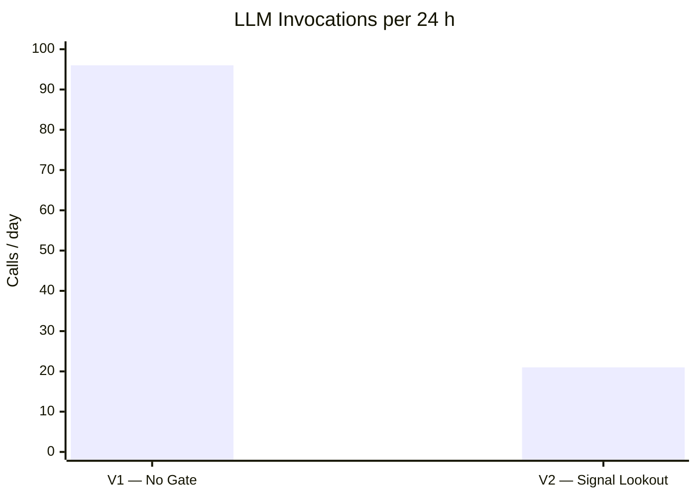
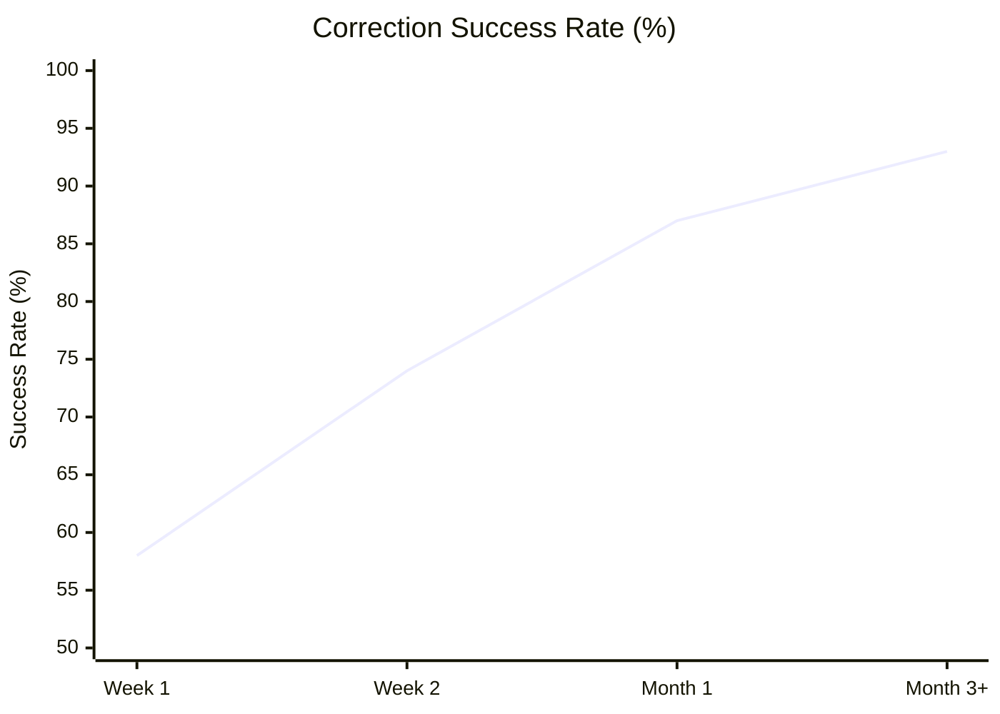
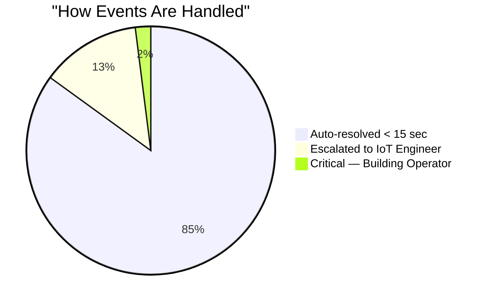
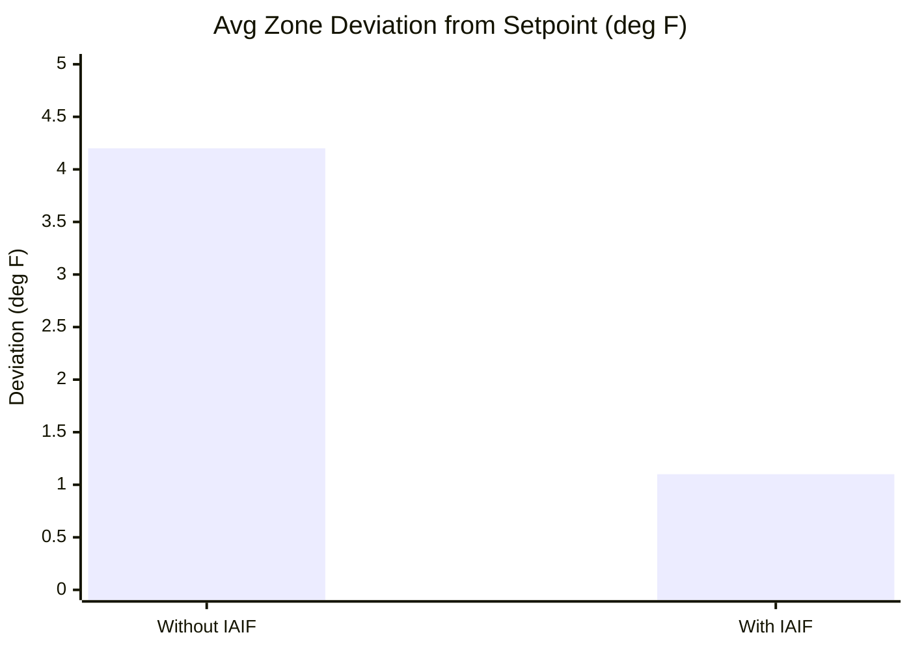

<div align="center">

# IAIF
### Interval Action Inference Framework

> IAIF is a fully autonomous HVAC intelligence layer that runs on the **Splunk Edge Hub's onboard NPU**.
> It detects anomalies through three purpose-built triggers, reasons with a locally-hosted LLM,
> applies setpoint corrections in under 15 seconds, and builds institutional knowledge of the building
> over time — without retraining the model or touching the cloud.

</div>

---

## Table of Contents

- [Architecture Overview](#architecture-overview)
- [Parameters & Foundational Logic](#parameters--foundational-logic)
- [How It Works](#how-it-works)
  - [The Agentic Learning Loop](#the-agentic-learning-loop)
  - [Signal Lookout — 3 Triggers](#signal-lookout--3-triggers)
- [Performance vs Standard Splunk Edge Hub](#performance-vs-standard-splunk-edge-hub)
- [Component Reference](#component-reference)
- [Quick Start](#quick-start)
- [Hardware Specs](#hardware-specs)

---

## Architecture Overview


---

## Parameters & Foundational Logic

IAIF makes every decision based on a defined set of physical and operational parameters. There are no black-box thresholds — every trigger condition and correction boundary is explicit.

### Input Parameters (per cycle, per zone)

| Parameter | Source | Unit | Used By |
|---|---|---|---|
| `zone_temp` | VAV onboard sensor | °F | Signal Lookout, Prompt Assembly |
| `setpoint` | BMS / operator config | °F | Signal Lookout, AI Orchestrator |
| `deviation` | `zone_temp − setpoint` | °F | All components |
| `humidity` | Onboard sensor | % RH | Prompt Assembly (comfort context) |
| `occupancy` | Cisco WiFi device count | devices | Prompt Assembly (load context) |
| `poe_watts` | Cisco Catalyst PoE switch | W | Signal Lookout Trigger 2 (EFE) |
| `outdoor_temp` | Open-Meteo Weather API | °F | Prompt Assembly (thermal load) |
| `zone_online` | Heartbeat / MQTT status | bool | Signal Lookout Trigger 0 |

### Foundational Decision Logic

IAIF operates on three foundational principles that distinguish it from conventional rule-based HVAC control:

**1 — Gate before reason.**
The LLM is expensive relative to a 2.3 TOPS NPU budget. Signal Lookout runs a deterministic pre-filter every cycle. Only anomalous states reach the LLM — normal states are logged and silently passed. This keeps NPU utilization below 30% and LLM invocations under 25/day.

**2 — Inject memory, not just data.**
A standard LLM prompt contains sensor readings. An IAIF prompt also contains the last N successful corrections for that zone and trigger pattern, ranked by relevance. The LLM's reasoning is grounded in what actually worked in this specific building, not just what works in general.

**3 — Close the loop.**
Every correction is recorded as `pending`. One cycle later, `verify_outcome()` checks whether the zone temperature recovered within ±2 °F of setpoint. The record is marked `SUCCESS` or `FAILED` and the signal confidence score for that zone/trigger pair is updated. Over time, high-confidence corrections are applied immediately; low-confidence ones are escalated to the engineer.

### Correction Bounds

The AI Orchestrator enforces hard safety limits regardless of LLM output:

| Parameter | Bound | Reason |
|---|---|---|
| Max single-cycle setpoint delta | ±5 °F | Prevents thermal shock |
| Min absolute setpoint | 65 °F | Occupant safety floor |
| Max absolute setpoint | 82 °F | Occupant safety ceiling |
| Tolerance band (verify_outcome) | ±2 °F | Defines recovery success |
| EFE trigger threshold | 15% over expected | Catches power anomalies |

### Belief Divergence Formula

Signal Lookout Trigger 1 computes a building-wide stress index each cycle:

```
belief_divergence = (zones_overheating + zones_undercooled) / total_active_zones

threshold_moderate  = 0.20   →  escalate to IoT engineer
threshold_critical  = 0.40   →  invoke LLM + alert building operator
```

---

## How It Works

### The Agentic Learning Loop

What separates IAIF from rule-based automation is that it learns from every correction cycle. The Knowledge Store acts as the system's institutional memory — accumulating zone-specific patterns over time without any model retraining.

```
Cycle N     ─── Signal Lookout fires (VAV-6: +7°F above setpoint)
                          │
                          ▼
               Knowledge Store retrieves prior context:
               "Last Tuesday, same solar-gain pattern on VAV-6
                → applied −3°F → recovered in 1 cycle"
                          │
                          ▼
               LLM reasons with history → applies −3°F correction
                          │
                    record_correction()
                          │
Cycle N+1   ─── verify_outcome() → temperature recovered → SUCCESS
                          │
               Knowledge Store updated:
               "VAV-6 solar gain: −3°F · success rate 19/20"
```

Over time the system develops **institutional knowledge** about the building's micro-patterns — morning solar gain on south-facing zones, server room cold bleeds overnight, peak occupancy spikes — all without touching the model weights.

---

### Signal Lookout — 3 Triggers

Signal Lookout is the decision gate that prevents the LLM from being invoked on every 15-minute cycle. It fires only when one of three anomaly conditions is met:

| # | Trigger | Detection Logic | Severity |
|:---:|---|---|:---:|
| 0 | **Sensor Loss** | VAV zone drops offline mid-cycle | 🔴 Critical |
| 1 | **Belief Divergence** | `(overheating zones + undercooled zones) / total` exceeds threshold | 🟡 Moderate · 🔴 Critical |
| 2 | **EFE Error** | Actual PoE watts vs. expected model > 15% delta | 🟡 Moderate |

When no trigger fires, Signal Lookout routes to the **IoT Engineer** for human review rather than invoking the LLM — keeping the human in the loop for ambiguous states.

---

## Performance vs Standard Splunk Edge Hub

> **⚠️ Synthetic Data** — Figures are generated from a simulated 30-day run across 26 VAV zones and 5 hubs. No real building data was used.

### LLM Compute — V1 (no gate) vs V2 (Signal Lookout)



### Knowledge Store — Correction Accuracy Over Time



### Event Resolution Breakdown (IAIF V2)



### Thermal Comfort — Zone Deviation from Setpoint



### Response Time Summary

| Event | Standard Edge Hub | IAIF V2 | Speedup |
|---|:---:|:---:|:---:|
| Zone overheating | 15 – 45 min | **< 15 sec** | ~120× |
| Multi-hub critical | 30 – 60 min | **< 30 sec** | ~60× |
| Sensor offline | Hours | **Immediate** | — |

---

## Component Reference

| Component | Source | Responsibility |
|---|---|---|
| 🟢 **Signal Lookout** | `edge/signal_lookout.py` | Anomaly gate — prevents unnecessary LLM invocation |
| 🟣 **Knowledge Store** | `edge/knowledge_store.py` | Agentic memory — stores corrections, verifies outcomes, injects history |
| ⬜ **Prompt Assembly** | `edge/prompt_assembly.py` | Constructs structured LLM prompt from sensors + retrieved memory |
| 🟡 **Ollama LLM** | `edge/ollama_client.py` | Local inference on NPU — llama3.2, no cloud dependency |
| 🔵 **AI Orchestrator** | `edge/edge_hub.py` | Applies BACnet setpoint corrections, feeds outcome back to Knowledge Store |
| ⬜ **CBC Controller** | `cvc/cvc_orchestrator.py` | Cross-hub aggregation, building-wide event escalation |
| ⬜ **Telegram Bot** | `controller/telegram_bot.py` | Pipeline A: engineer digest · Pipeline B: operator critical alert |

---

## Quick Start

```bash
# Clone the repository
git clone https://github.com/Adityaagulatii/edge_ai.git
cd edge_ai

# Run the demo (no dependencies — mock LLM responses built in)
python -X utf8 iaif_mini_demo.py
```

```bash
# Run with a live Ollama instance
ollama pull llama3.2
python -X utf8 iaif_mini_demo.py --live
```

The demo cycles through three pre-built scenarios:
1. **Solar gain** — Hub-2 VAV-6 overheating (+7 °F above setpoint)
2. **Server cold bleed** — VAV-8 undercooled (−5.8 °F)
3. **Multi-hub critical** — Hub-4 VAV-20 severe overheat (+10 °F), CBC escalation triggered

---

## Hardware Specs

**Splunk Edge Hub** — Toradex Verdin iMX8M Plus SoM

| Component | Specification |
|---|---|
| CPU | 4× ARM Cortex-A53 @ 1.8 GHz |
| NPU | NXP Vivante VIP8000 — **2.3 TOPS** (INT8) |
| RAM | 8 GB LPDDR4 |
| Storage | 32 GB eMMC |
| ML Runtimes | TensorFlow Lite · ONNX Runtime · PyTorch via NXP eIQ |
| Protocols | MQTT · OPC-UA · Modbus TCP · SNMP · Splunk Universal Forwarder |

---

<div align="center">
<sub>Built on the Splunk Edge Hub platform · Designed for on-premise, air-gapped deployments</sub>
</div>
